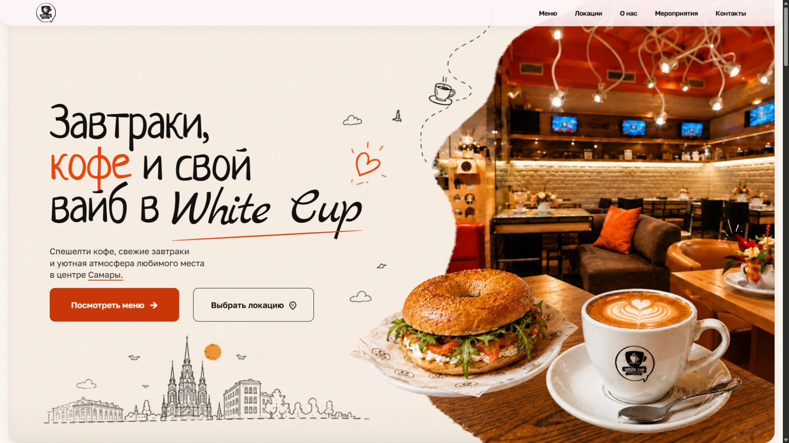

# White Cup

Демонстрационный сайт кофейни в Самаре: меню, фотографии, история места, события и контакты. Адаптивная вёрстка с отдельными графическими слоями и мобильной навигацией.



[Открыть демо](https://kaigo.space/site/whitecup/)

## Стек и задачи

React, TypeScript, Vite. Компоненты секций, навигация, фотогалерея, адаптивность и проверка визуальной композиции на разных экранах.

## Локальный запуск

```bash
npm ci
npm run dev
```

Локальный адрес: [127.0.0.1:4175](http://127.0.0.1:4175/). Для сборки и тестов:

```bash
npm test -- --run
npm run build
```

## Документация

Подробности реализации, источники, оговорки по данным и ссылки на визуальные проверки сохранены в [IMPLEMENTATION.md](IMPLEMENTATION.md). README не заменяет эти материалы и не означает повторный запуск release-проверок.

Это портфолио-демо, не официальный сайт или заявление о сотрудничестве. Фотографии и фирменные материалы имеют собственных правообладателей; их использование в других проектах требует отдельного разрешения.
